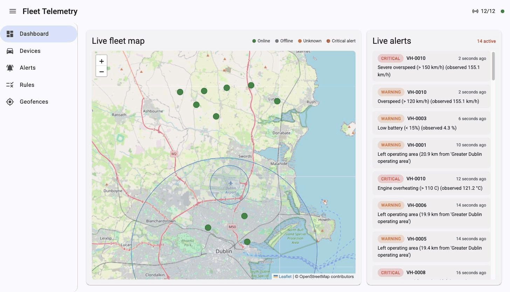
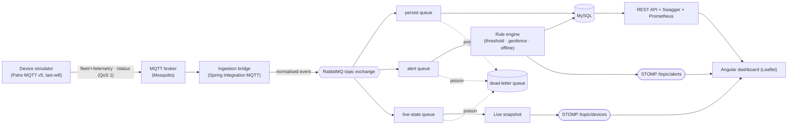

# Fleet Telemetry & Alerting Platform

[](https://github.com/rafaelinfante/fleet-telemetry-platform/actions/workflows/ci.yml)
[](https://github.com/rafaelinfante/fleet-telemetry-platform/actions/workflows/codeql.yml)
[](LICENSE)


An event-driven platform where a fleet of vehicles streams telemetry over **MQTT**, a Spring Boot
service ingests and processes it through **RabbitMQ**, and a live **Angular** dashboard shows the fleet
moving on a map with alerts firing in real time.



I built this to mirror the device-integration work I do on a production parking/mobility platform (which
uses Spring Integration MQTT), and to have a public, runnable example of an event-driven system that uses
**two message brokers, each for what it is genuinely best at**. The whole thing comes up with one command
and needs no hardware and no cloud keys.

## Why two brokers (the design decision)

This is the part I find most interesting to talk through, because reaching for "a message broker" without
asking *which kind* is a common mistake.

- **MQTT (Eclipse Mosquitto) is the device edge.** It is a lightweight pub/sub protocol designed for many
  constrained devices on flaky networks: tiny frames, QoS levels, retained messages, and a **last-will
  and testament** that lets the broker announce a device that dropped off ungracefully. That is exactly
  what a vehicle (or a parking meter) needs to speak.
- **RabbitMQ (AMQP) is the backend backbone.** Once a reading is inside the platform I want reliable
  routing, **fan-out to several independent consumers**, per-message acknowledgements, retries, and a
  **dead-letter queue** for messages that can't be processed. MQTT is deliberately thin and doesn't give
  you work-queue semantics like that; AMQP does.

So the ingestion service is a **bridge**: it subscribes to the MQTT device topics, normalises each reading,
and republishes it onto a RabbitMQ topic exchange where the real work happens. Using the right tool for
each half of the problem — and being able to say why — is the whole point of the project.

(Why not Kafka? Kafka is a retained, replayable event log built for high-volume streaming — but it doesn't
speak MQTT, so it can't replace the device edge, and for backend work-queues with a dead-letter queue
RabbitMQ is the simpler fit. Kafka earns its place once telemetry needs to be retained and replayed for
analytics, not for transient work dispatch — see the roadmap.)

## Architecture



The simulator deliberately uses the **raw Paho MQTT v5 client** (one connection per vehicle, each with its
own last-will), the way real device firmware would. The platform side uses **Spring Integration MQTT** to
subscribe. The contrast between the two is intentional.

## What happens under load

The two-broker split is also what makes this resilient under bursts. MQTT ingestion never blocks on
processing: the bridge just normalises and publishes, and RabbitMQ absorbs the spike. Each consumer then
drains its queue at its own pace with an explicit **prefetch** and **concurrency** setting — persistence
scales out across several concurrent consumers, while alert evaluation and live-state run single-threaded
so their state stays consistent. Anything a consumer can't process is retried a few times and then parked
on the **dead-letter queue** (observable via a Prometheus counter and the DLQ log consumer) instead of
blocking the stream or being silently dropped. The simulator injects a small fraction of corrupt packets
so you can watch this happen.

## Features

- **MQTT v5 ingestion** with QoS, retained status topics and **last-will offline detection**.
- **MQTT to RabbitMQ bridge** publishing normalised events onto a topic exchange.
- **Topic exchange + three work queues** (persist / alert / live-state) with manual-ack semantics and a
  shared **dead-letter queue**; queues are quorum (replicated) with an explicit delivery limit.
- **Idempotent persistence** — a unique `(device, recordedAt)` constraint means a redelivered message is
  never stored twice.
- **Rules-based alerting** — configurable thresholds (speed, battery, fuel, engine temp), **geofence**
  enter/exit breaches, and **offline** detection; alerts auto-resolve when the condition clears.
- **Live dashboard** over STOMP WebSocket — a Leaflet map with moving markers and a live alert feed.
- **REST API** to query devices, readings and alerts and to manage alert rules and geofences, with
  OpenAPI/Swagger UI and RFC 9457 (`application/problem+json`) error responses.
- **Observability** — Prometheus metrics (ingestion rate, per-queue depth, alerts raised, dead-lettered
  messages, devices online) plus a correlation id on every request.
- **Runs with no hardware** — a device simulator publishes realistic telemetry for a configurable fleet.

## Tech stack

- **Backend:** Java 17, Spring Boot 3.5, Spring Integration MQTT (Eclipse Paho v5), Spring AMQP, Spring
  Data JPA, Spring WebSocket/STOMP, MySQL 8 + Flyway, MapStruct, springdoc-openapi, Micrometer/Prometheus.
- **Frontend:** Angular 20 (standalone, signals, zoneless), Angular Material + Bootstrap 5, Leaflet,
  `@stomp/stompjs`, Chart.js.
- **Infra & quality:** Mosquitto, RabbitMQ, MySQL and the apps in Docker Compose; JUnit 5, Mockito,
  Testcontainers (Mosquitto + RabbitMQ + MySQL), JaCoCo, GitHub Actions, CodeQL, Dependabot.

> The backend is deliberately Java 17 / Spring Boot 3.5 to mirror the production stack it is modelled on,
> rather than chasing the newest release.

## Run it in 30 seconds

```bash
cp .env.example .env
docker compose up --build
```

Then open:

| What | URL |
|------|-----|
| Live dashboard | http://localhost:8088 |
| Swagger UI | http://localhost:8080/swagger-ui.html |
| Prometheus metrics | http://localhost:8080/actuator/prometheus |
| RabbitMQ management | http://localhost:15672 (`fleet` / `fleet`) |

Within a few seconds you'll see vehicles moving on the map and alerts appearing as the simulator triggers
overspeed, overheating, low battery, geofence breaches and the occasional offline device.

```bash
curl http://localhost:8080/api/devices | jq '.[0]'
curl "http://localhost:8080/api/alerts?status=ACTIVE" | jq '.content[0]'
```

## How alerting works

Rules live in the database and are editable through the API (and the dashboard). Three kinds:

- **Threshold** — compare a metric (`SPEED`, `BATTERY`, `FUEL`, `ENGINE_TEMP`) against a value with an
  operator, e.g. *speed > 120 km/h*.
- **Geofence** — a circular area (centre + radius); alert when a device is inside (`ENTER`) or outside
  (`EXIT`) it. Distance is computed with the haversine formula.
- **Offline** — raised instantly from a device's MQTT last-will, and as a safety net by a scheduled job
  that flags devices that simply went quiet. The alert resolves automatically when telemetry resumes.

Evaluation is edge-triggered without storing previous state: at most one active alert exists per
(device, rule), so an alert is raised the first time a condition holds and resolved when it clears.

## Testing

```bash
mvn verify          # backend: unit tests + Testcontainers integration tests
cd frontend && npm test
```

The integration tests spin up **Mosquitto, RabbitMQ and MySQL** with Testcontainers and exercise the full
path end to end: a message published over MQTT travels through both brokers, is persisted, raises an alert,
and a corrupt packet is shown landing on the dead-letter queue. Idempotency is verified by redelivering the
same reading and asserting it is stored once.

## Project layout

```
fleet-telemetry-platform/
├── backend/     Spring Boot service: mqtt, messaging, alerting, domain, web, observability
├── simulator/   Spring Boot device-fleet simulator (Paho MQTT v5)
├── frontend/    Angular 20 dashboard
├── infra/       Mosquitto configuration
└── docker-compose.yml
```

## Roadmap

- **MQTT device authentication** — per-device credentials with ACLs, or mutual-TLS client certificates.
  The demo broker accepts anonymous connections; authenticating a large device fleet is the natural next
  step (and a good interview conversation in its own right).
- **A real time-series store** (TimescaleDB or InfluxDB) for readings, with downsampling and retention.
- **A retained event log (Kafka)** as the backend backbone if telemetry needs to be replayed for
  analytics or fanned out to new consumers — RabbitMQ stays the right fit for transient work-queue dispatch.
- Securing the REST API and WebSocket, per-tenant fleets, and alert notifications (email / SMS / webhook).
- OpenTelemetry/OTLP tracing, and moving the in-process STOMP fan-out onto the RabbitMQ STOMP relay to
  scale the dashboard horizontally.

## License

[MIT](LICENSE)
